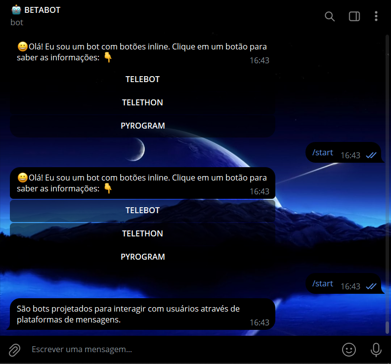

# COMANDOS INLINES COM TELETHON 
🤤ESTE É UM BOT TELEGRAM DE COMANDOS DE BOTÕES INLINES. FEITO COM TELETHON!

 <br>

## DESCRIÇÃO:
Este bot do Telegram apresenta informações sobre diferentes bibliotecas e ferramentas usadas para criar bots no Telegram. Ele permite que os usuários cliquem em botões inline para receber informações específicas sobre cada uma das ferramentas listadas.

## EXECUTANDO O PROJETO:
1. **Colocando suas Credenciais**:
   - Para usar o `Telethon`, (Que se conecta diretamente a API do Telegram), é necessário autorizar o cliente com suas credenciais. Siga as instruções fornecidas pelo Telegram em [Obtendo api_id e api_hash](https://core.telegram.org/api/obtaining_api_id). As credenciais são compostas por duas partes: `api_id` e `api_hash`. [SAIBA MAIS.](https://docs.telethon.dev/en/stable/basic/signing-in.html)
   - Você também precisará do token do seu bot, que pode ser obtido através do [@BotFather](https://t.me/BotFather).  
   - No arquivo `./CODIGO/DADOS.py`, substitua os placeholders `api_id`, `api_hash` e `bot_token` pelas suas credenciais reais.

2. **Instalando as dependências:**
   - Antes de executar o bot, certifique-se de instalar todas as dependências necessárias. No terminal, execute o seguinte comando para instalar as dependências listadas no arquivo `requirements.txt` em `CODIGO`:
   ```bash
   pip install -r requirements.txt
   ```

3. **Inicie o Bot:**
   - Execute o bot do Telegram iniciando-o com o seguinte comando:
    ```bash
    python CODIGO.py
    ```

4. **Interagindo com o Bot**:
   1. **Iniciar o Bot:**
      - Envie o comando `/start` para iniciar o bot.

   2. **Interagir com Botões Inline:**
      - Após enviar `/start`, o bot responderá com uma mensagem de boas-vindas e botões inline.
      - Clique em qualquer um dos botões para obter informações sobre a ferramenta correspondente:

      - **TELEBOT:** Informações gerais sobre bots projetados para interagir com usuários através de plataformas de mensagens.
      - **TELETHON:** Detalhes sobre Telethon, uma biblioteca Python para interagir com a API do Telegram.
      - **PYROGRAM:** Explicação sobre Pyrogram, uma biblioteca Python para comunicação direta com os servidores do Telegram.

   3. **Receber Respostas:**
      - Após clicar em um botão, o bot editará a mensagem original para fornecer as informações solicitadas diretamente na conversa.

## NÃO SABE?
- Entendemos que para manipular arquivos em muitas linguagens e tecnologias relacionadas, é necessário possuir conhecimento nessas áreas. Para auxiliar nesse aprendizado, oferecemos alguns subsidios:
* [VEJA A DOCUMENTAÇÃO](https://docs.telethon.dev/en/stable/)
* [CURSO SUGERIDO: PYROGRAM](https://github.com/VILHALVA/CURSO-DE-PYROGRAM)
* [CURSO SUGERIDO: TELEBOT](https://github.com/VILHALVA/CURSO-DE-TELEBOT)
* [CURSO DE PYTHON](https://github.com/VILHALVA/CURSO-DE-PYTHON)
* [CONFIRA MAIS CURSOS](https://github.com/VILHALVA?tab=repositories&q=+topic:CURSO)

## CREDITOS:
- [PROJETO CRIADO PELO VILHALVA](https://github.com/VILHALVA)

